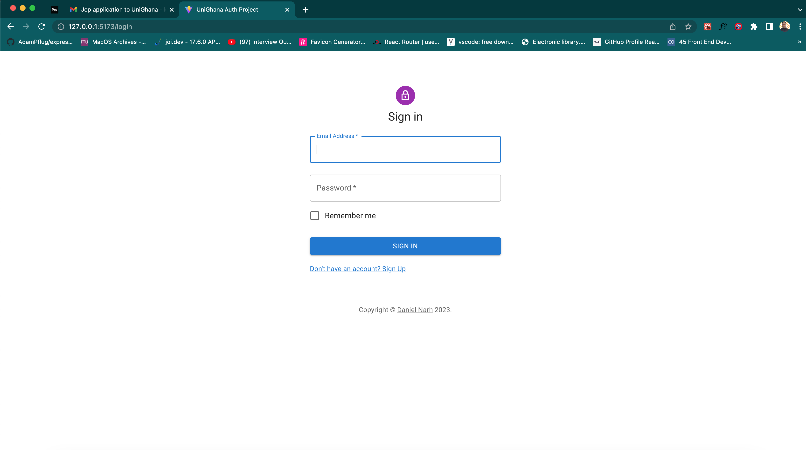
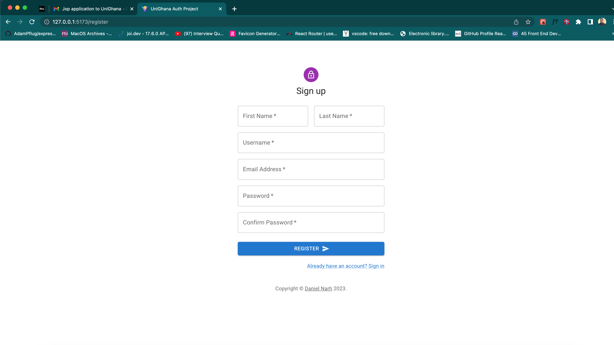
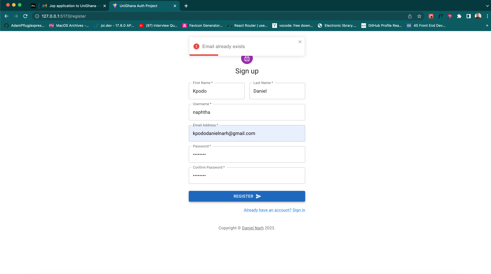
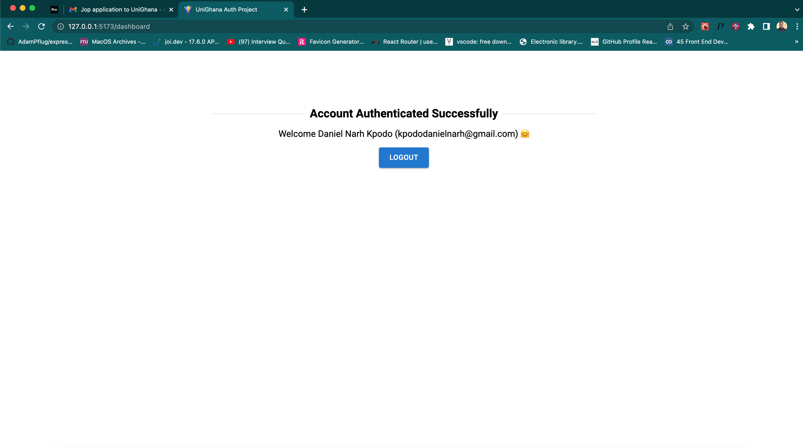

[](https://choosealicense.com/licenses/mit/)

# MERN Authentication System

A MERN stack authentication project by **UNIGHANA**

## Tech Stack

**Client:** React, Vite, Context API, Material UI, React Router, Axios

**Server:** Node, Express, Mongodb

## Project Essentials

- User validation
- Checks if email or username already exists
- Prompts invalid credentials
- Provides alerts for login/logout

## Project Images






## Environment Variables for /backend

To run this project, you will need to add the following environment variables to your .env file

`MONGO_URL=mongodb://localhost:27017/unighana`

`JWT_LIFETIME=1d`

`JWT_SECRET=<string>`

`PORT=8001`

## Installation

The project is separated into client and backend. This is to facilitate easy deployment

### Installing the backend

```bash
  cd backend
  yarn install or npm install
  set up .env in root folder as shown above
  run node app.js (This will initiate the server and establish a connection to your local mongodb once configured correctly)

```

### Installing the Client Side

```bash
  cd client/
  yarn install or npm install
  run npm run dev (Vite must be installed on your local machine)
  - This will spin app the interface on your browser instantly
  - Once running make sure to change   `
  ** const baseURL = "http://localhost:8001/api/v1" ** in AuthContext.js to match your backend port.
  - Everything should work fine after this process (Client should be able to talk to backend now)
```
